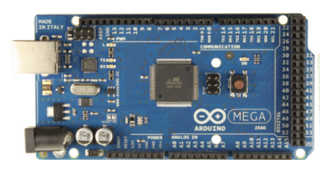
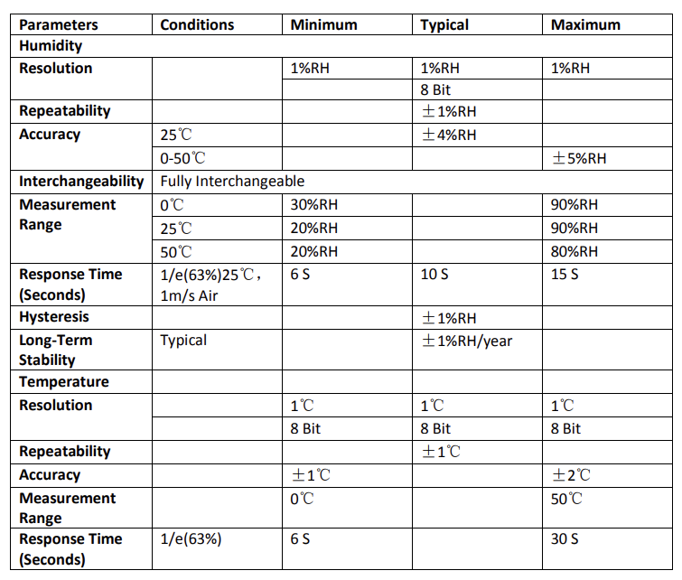
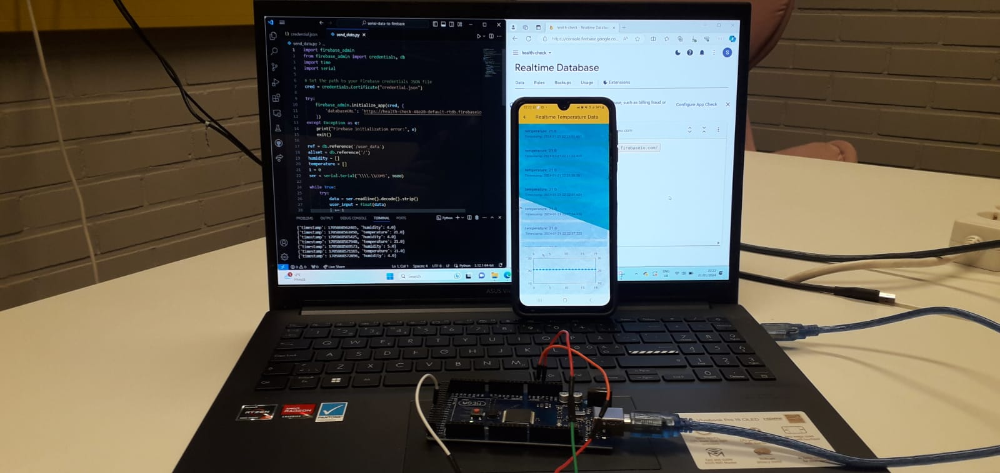
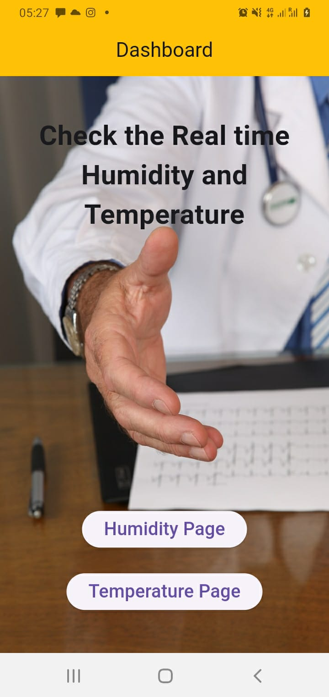

# IoT Mini-Project-2

## INTRODUCTION TO PROJECT

### Description

This project is based on Health Check Demonstration Using Temperature and Humidity sensors.Measuring the temperature of a patient is an important aspect of nursing care. Temperature monitoring should also be used to measure the effectiveness of, and track the side effects arising from, any intervention delivered to the patient.therefor by this project nurses can mesaure patients room temparature,humidity and patients body temparature by using mobile application without physically reaching to patient.

#### Hardware Devices

##### Arduino Mega 2560

The Arduino Mega 2560 is a microcontroller board based on the ATmega2560 (datasheet). It has 54 digital input/output
pins (of which 14 can be used as PWM outputs), 16 analog inputs, 4 UARTs (hardware serial ports), a 16 MHz crystal
oscillator, a USB connection, a power jack, an ICSP header, and a reset button. It contains everything needed to support
the microcontroller; simply connect it to a computer with a USB cable or power it with a AC-to-DC adapter or battery to
get started. The Mega is compatible with most shields designed for the Arduino Duemilanove or Diecimila.

###### Specifications

- Microcontroller - ATmega2560
- Operating Voltage - 5V
- Input Voltage (recommended) - 7-12V
- Input Voltage (limits) - 6-20V
- Digital I/O Pins - 54 (of which 15 provide PWM output)
- Analog Input Pins - 16
- DC Current per I/O Pin - 40 mA
- DC Current for 3.3V Pin - 50 mA
- Flash Memory - 256 KB of which 8 KB used by bootloader
- SRAM - 8 KB
- EEPROM - 4 KB
- Clock Speed - 16 MHz

###### Memory

The ATmega2560 has 256 KB of flash memory for storing code (of which 8 KB is used for the bootloader), 8 KB of SRAM
and 4 KB of EEPROM (which can be read and written with the EEPROM library).

###### Power Pins

- VIN - The input voltage to the Arduino board when it's using an external power source (as opposed to 5 volts from the
USB connection or other regulated power source). You can supply voltage through this pin, or, if supplying voltage via
the power jack, access it through this pin.
- 5V - This pin outputs a regulated 5V from the regulator on the board. The board can be supplied with power either
from the DC power jack (7 - 12V), the USB connector (5V), or the VIN pin of the board (7-12V). Supplying voltage via
the 5V or 3.3V pins bypasses the regulator, and can damage your board. We don't advise it.
- 3V3 - A 3.3 volt supply generated by the on-board regulator. Maximum current draw is 50 mA.
- GND - Ground pins

##### DHT 11 Humidity & Temperature Sensor

[]

DHT11 Temperature & Humidity Sensor features a temperature & humidity sensor
complex with a calibrated digital signal output. By using the exclusive digital-signal-acquisition
technique and temperature & humidity sensing technology, it ensures high reliability and
excellent long-term stability. This sensor includes a resistive-type humidity measurement
component and an NTC temperature measurement component, and can be connected to a high performance microcontroller, offering excellent quality, fast response, anti-interference 
ability and cost-effectiveness.

###### Power and Pin

DHT11’s power supply is 3-5.5V DC. When power is supplied to the sensor, do not send any 
instruction to the sensor in within one second in order to pass the unstable status. One 
capacitor valued 100nF can be added between VDD and GND for power filtering.

## Technologies and process 

- Aruino Programming 
- Serial Communication 
- Serial data to Firebase
- Firebase to Realtime data base
- Flutter for Mobile application development

## Overview
This project aims to monitor and record patients data, specifically humidity and temperature, using a microcontroller connected to a sensor. The data is sent to a Firebase Realtime Database for storage and further analysis.

### Components

#### Firebase Integration
The project utilizes Firebase to store and manage data. Firebase provides a cloud-based Realtime Database, which allows seamless integration with the microcontroller.

##### Firebase Initialization:
The code initializes the Firebase app with the provided credentials, connecting to the Realtime Database at 'https://health-check-48e20-default-rtdb.firebaseio.com'.

#### Serial Communication
The microcontroller communicates with the sensor using a serial connection. The received data, containing humidity and temperature values, is processed and sent to the Firebase database.

##### Serial Connection:
The code establishes a serial connection with the sensor via the COM5 port, with a baud rate of 9600.

#### Data Collection and Processing
Data from the sensor is collected in real-time, and the code processes it before storing it in the Firebase database.

##### Data Parsing:
The received data is read, decoded, and converted into a floating-point number for further processing.

##### Timestamping:
Each data entry is associated with a timestamp, which is crucial for tracking when the data was recorded.

#### Data Storage
The processed data is organized into two arrays (humidity and temperature) and then stored in the Firebase Realtime Database.

##### Firebase Data Structure:
Data is structured with timestamped entries for humidity and temperature, facilitating easy retrieval and analysis.

##### Realtime Update:
The Firebase database is updated in real-time with the latest data from the sensor.

#### Error Handling
The code includes mechanisms to handle errors gracefully, ensuring the stability of the data pipeline.

##### Error Types:
Two types of errors are handled: ValueError for data parsing issues and generic exceptions for unknown errors.

### Testing Methods
To ensure the robustness of the system, several testing methods have been implemented.

#### Unit Testing:

Verify that each component functions as expected in isolation. This includes testing serial communication, data parsing, and Firebase integration.

#### Integration Testing:
Validate that all components work together seamlessly. This involves testing the end-to-end flow of data from the sensor to Firebase.

#### Error Testing:

Simulate error scenarios, such as incorrect data formats or loss of connectivity, to confirm that the system gracefully handles these situations.

### Usage
Connect the microcontroller to the sensor and ensure the serial port is correctly configured.
Run the code, which will continuously read data from the sensor and update the Firebase database.
Access the Firebase Realtime Database to view the stored humidity and temperature data.

|Layout                           |  data                        |
| ----------------------------------- | ----------------------------------- |
|  |  | 

## Data Pipe Line

1. Thermal and Humidity data detection from the sensor
2. Sensor to Analog signal 
3. Analog data convertion to Digital data
4. Digital data to computer through serial caommunication
5. Digital data to Firebase Rraltime database 
6. Realtime data to Mobile application

## Installation Instruction

- Connect the sensor board to USB port
- Open the python script and make sure the com port number is as same as the USB port the sensor board is plugged in
- If that is different, change the port number
- Then run the python code, in the output window, the results can be seen (humidity and temperature)
- Then open the mobile application, and then the data can be seen.
- The data is stored in the firebase real time database permanently.

## Data Visualization

|Dashboad                            |  Realtime Temparature                           | Realtime Humidity                                     |
| ----------------------------------- | ----------------------------------- | ------------------------------------------- |
|  |  |  |

### Project Demo

{width="500"}

## Further Development

The Health Checking project aims to evolve into a comprehensive wearable device for patient health monitoring. This expansion incorporates additional sensors such as a gyroscope and step counting sensor to provide a more holistic view of the patient's well-being.

### Gyroscope Integration
The introduction of a gyroscope sensor enhances the device's capabilities by measuring orientation, angular velocity, and movement. This data can be crucial for understanding a patient's posture, mobility, and detecting anomalies in movement patterns. Also, the gyroscope can be connected to the same set up and then an integrated sensing module can be designed for additional data collection.

#### Data Processing:

Code enhancements will be made to read and process gyroscope data, converting it into meaningful insights about the patient's movements.

#### Firebase Integration:

Gyroscope data will be seamlessly integrated into the existing Firebase database structure for centralized storage and analysis.

### Step Counting Sensor
The inclusion of a step counting sensor facilitates the monitoring of a patient's physical activity. This feature can be particularly valuable for assessing the patient's mobility and adherence to prescribed activity levels.

#### Step Counting Algorithm:

A step counting algorithm will be implemented to accurately track the number of steps taken by the patient.

#### Firebase Integration:

Step count data will be incorporated into the Firebase database, creating a comprehensive health profile for each patient.

### Wearable Device Development
The project will evolve into a wearable device that patients can comfortably wear throughout the day, allowing continuous health monitoring without hindering daily activities.

#### Form Factor:

Design considerations will be taken into account to ensure the wearable device is lightweight, comfortable, and non-intrusive.

#### Battery Optimization:

Efforts will be made to optimize power consumption to extend the device's battery life, ensuring continuous monitoring without frequent recharging.

#### Data Visualization:

Develop a user-friendly interface, possibly through a mobile app, to visualize health data for both patients and healthcare providers.

## Development as a Wearable Device

The Health Check wearable device is envisioned to be a platform for continuous improvement and expansion. Future enhancements may include the integration of additional sensors for vital sign monitoring, machine learning algorithms for predictive analytics, and collaboration with healthcare providers for personalized patient care.

This project represents a step towards a more comprehensive and proactive approach to patient health monitoring, promoting early detection and intervention for improved healthcare outcomes.